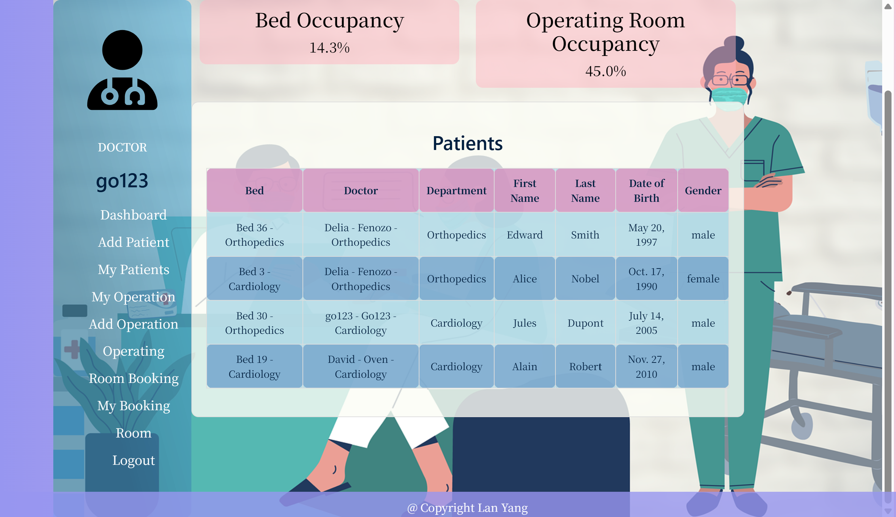

<h1 align="center">
    🏥 &emsp; Welcome to Inpatient Management System &emsp; 🏨
</h1>

*A project by Lan YANG to help hospitals and medical professionals efficiently manage inpatients and surgeries 🩺*

<p align="center">
    
</p>

---

## 🗺️ &ensp; Project Overview

The **Inpatient Management System** is a web application built with **Django** (Python) to manage patient hospitalization, bed assignments, and surgical scheduling in hospitals.

It provides tools for doctors to:

- Admit and manage patients
- Schedule and track operations
- Reserve and manage operating rooms
- Access statistics such as bed and OR occupancy

**Tech Stack:**

- **Backend:** Python, Django
- **Frontend:** HTML5, CSS3, JavaScript
- **Database:** SQLite (default), compatible with PostgreSQL
- **Other:** Git, Docker (optional), WSL/Linux compatible

---

## 🧩 &ensp; Features

### ✅ Patient Management

- Add, view, edit, and discharge patients
- Search patients by name or department
- Associate patients with beds in hospital wards

### ✅ Operation Scheduling

- Add and track operations
- Assign operating rooms based on availability
- Respect OR opening hours:
  - Level A: 24h/day
  - Level B: 12h/day
  - Level C: 8h/day, closed on weekends

### ✅ Operating Room Booking

- Book operating rooms for scheduled operations
- View and manage your reserved rooms
- Prevent conflicts and invalid booking times

### ✅ Dashboard and Statistics

- Personalized dashboard for each doctor
- Real-time statistics on beds and operating room occupancy
- Quick access to patient and operation lists

### ✅ Security

- User authentication for doctors
- CSRF protection and session management
- Role-based access for admin and doctor users

---

## 👷 &ensp; How to Run Locally

### 📦 Requirements

- Python 3.8+  
- Django 4.1+  
- pip for package management  
- (Optional) Virtual environment  

### 🔧 Installation

```bash
git clone git@github.com:ISDouglas/Inpatient_management_system.git
cd Inpatient_management_system
python -m venv venv
source venv/bin/activate  # Linux/macOS
venv\Scripts\activate     # Windows
pip install -r requirements.txt


